# SoundSphere
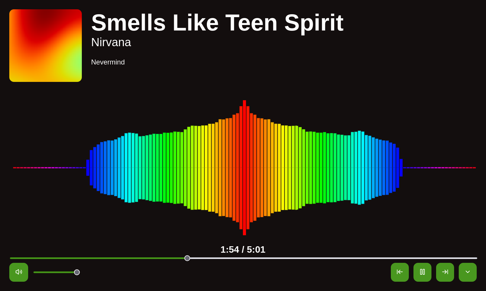

**Semestrální práce - KAJ 2026 - Robin Míček**

Webová aplikace, která slouží jako hudební přehrávač a správce playlistů a funguje plně offline. 
Každý playlist je doplněn unikátním generovaným cover artem a během přehrávání je k dispozici vizualizace zvuku, 
která reaguje na aktuální frekvence.

## Uživatelská dokumentace
### Přidání playlistu
Nový playlist je možné vytvořit pomocí tlačítka *New playlist* (**1**) na domovské stránce.
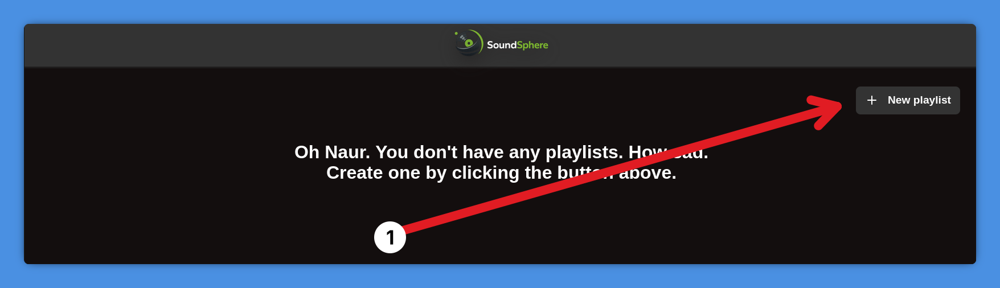

Následně se otevře formulář, ve kterém vyplnite název (**1**) a popis (**2**) playlistu.
Poté klikněte na tlačítko *Save* (**3**).
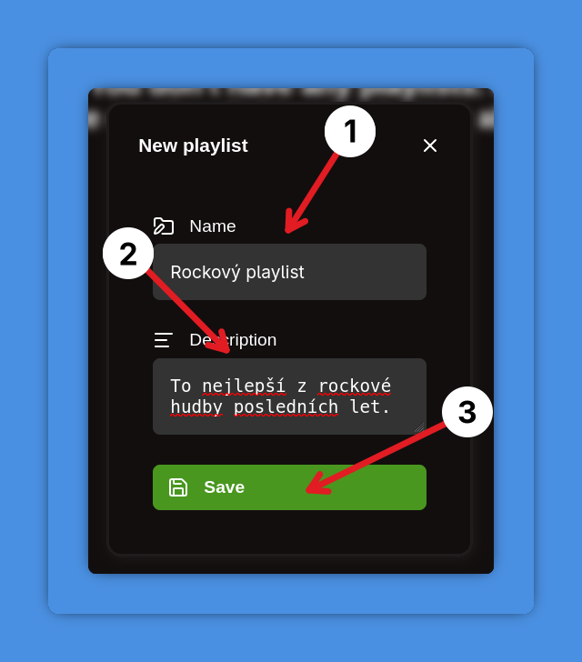

Vytvoření playlist se následně zobrazí na domovské obrazovce a kliknutím na něj zobrazíte jeho detail (**2**).
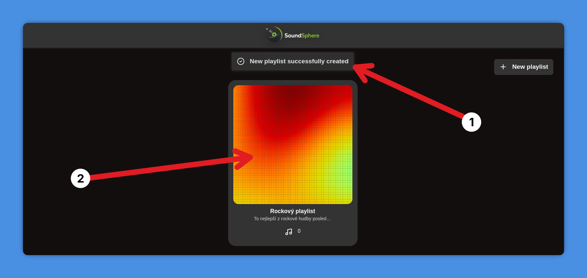

### Upravení playlistu
Playlist upravíte v jeho detailu kliknutím na tlačítko *Edit* (**1**).
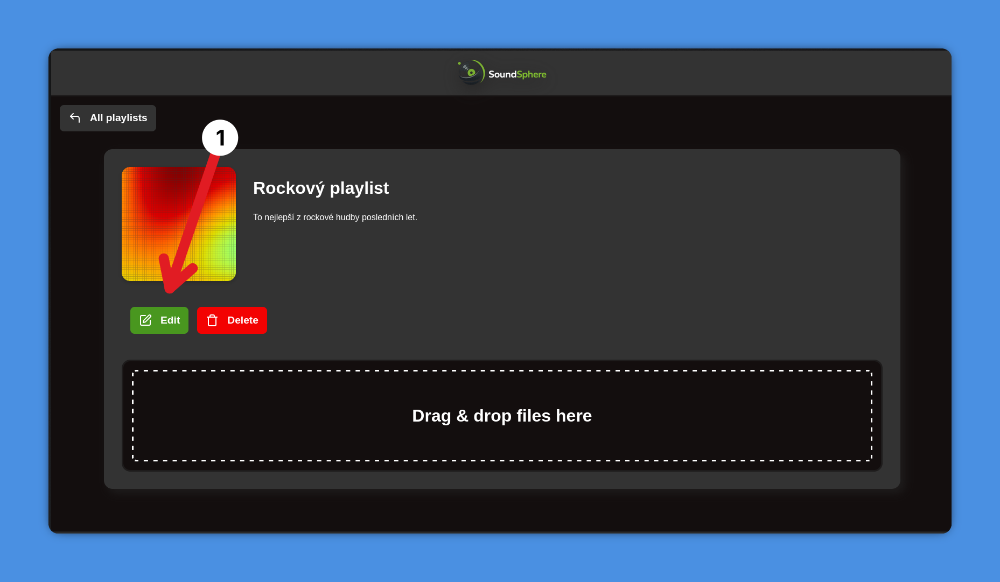

Vyskočí na Vás formulář, ve kterém můžete upravit jeho jméno (**1**) a popis (**2**). 
Změny potvrdíte kliknutím na tlačítko *Save* (**3**).
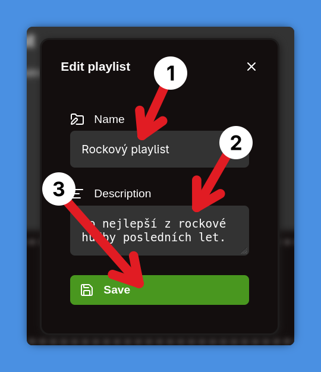

### Smazání playlistu
Playlist smažete kliknutím na tlačítko *Delete* (**1**) v jeho detailu.
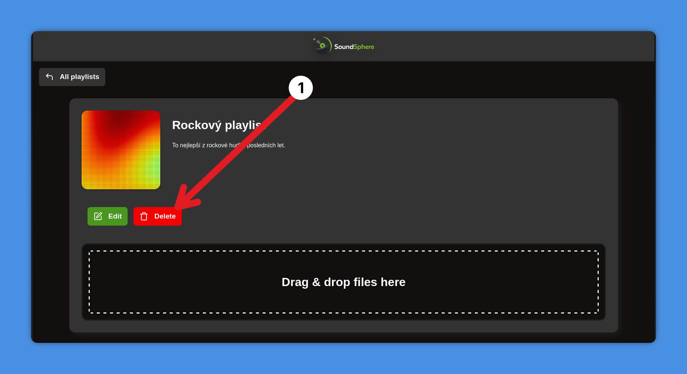

Po úspěšném smazání budete přesměrování na domovskou stránku.

Pozn. Při smazání playlistu se zároveň smažou i všechny skladby, které playlist obsahoval.

### Přidání skladby
Skladby přidáte v detailu playlistu, do kterého je chcete přidat.
Přetáhněte skladby to zóny *Drag & drop files here* (**1**), 
případně kliknutím na tu samou zónu se otevře prohlížeč souborů, ze kterého vyberete skladby pro nahrání.
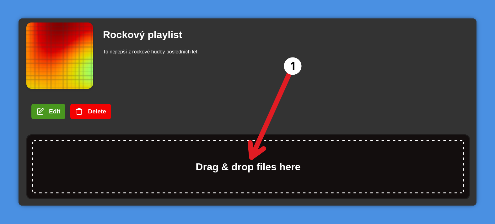

Následně se ukáže seznam Vámi zvolených skladeb (**1**), kliknutím na tlačítko *Upload* (**2**) je potvrdíte a budou nahrány.
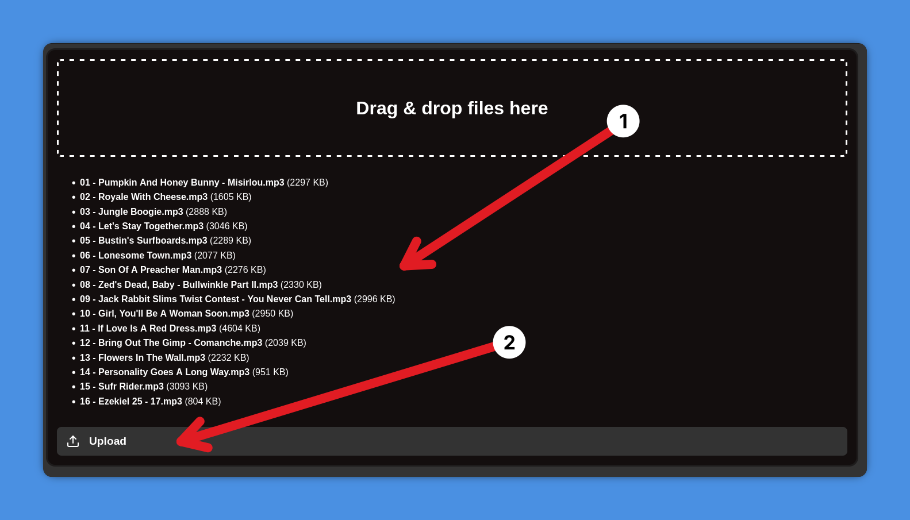

Poté jsou již nahrané skladby (**1**) dostupné v playlistu.
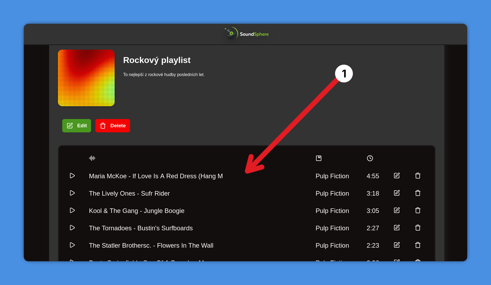

### Upravení skladby
Pro upravení skladby klikněte na tlačítko *Tužky* (**1**) v seznamu skladeb.
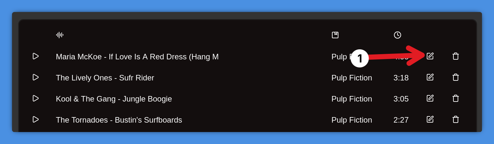

V otevřeném formuláři následně můžete upravit její název (**1**), interpreta (**2**) nebo album (**3**). Změny potvrdíte kliknutím na *Save* (**4**).
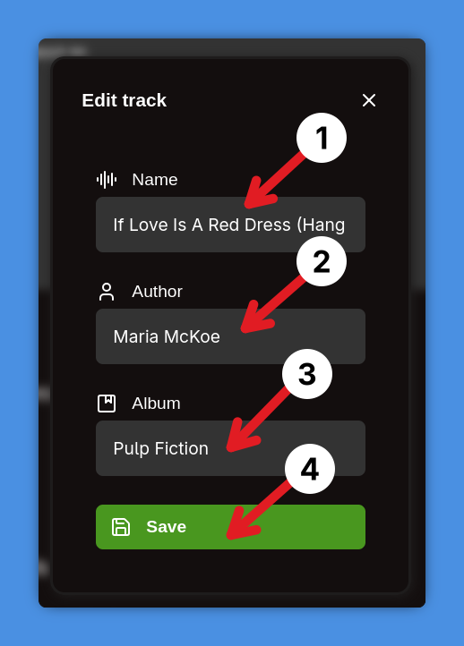

### Smazání skladby
Skladbu je možné smazat pomocí tlačítka *Koše* (**1**) v seznamu skladeb.
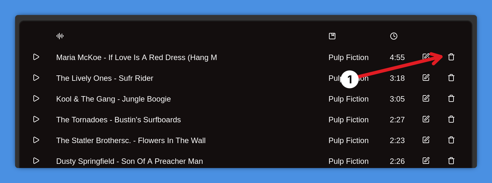

### Přehrání skladby
Konkrétní skladbu je možné přehrát pomocí tlačítka *Spustit* (**1**) v seznamu skladeb.
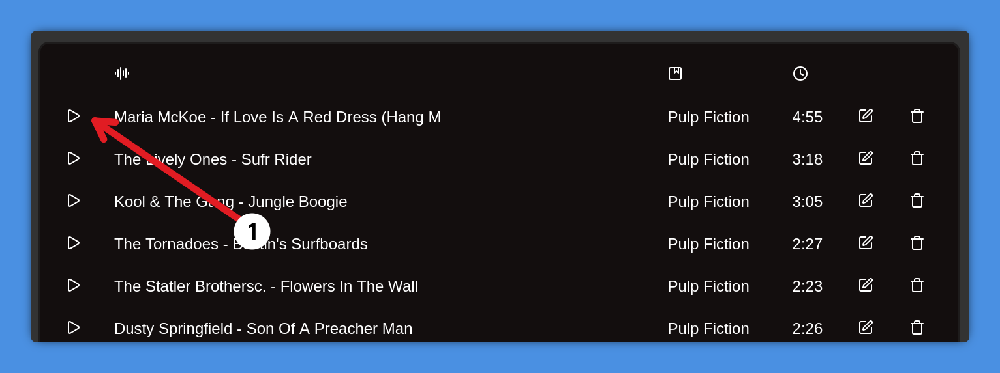

### Ovládání přehrávače
1. Ztlumení přehrávače
2. Ovládání hlasitosti
3. Posunutí v čase
4. Název přehrávané skladby
5. Aktuální a celkový čas skladby
6. Předchozí skladba
7. Spuštění/zastavení přehrávání
8. Následující skladba
9. Otevření celoobrazovkového přehrávače

Ovládání v celoobrazovkovém přehrávači funguje obdobně.

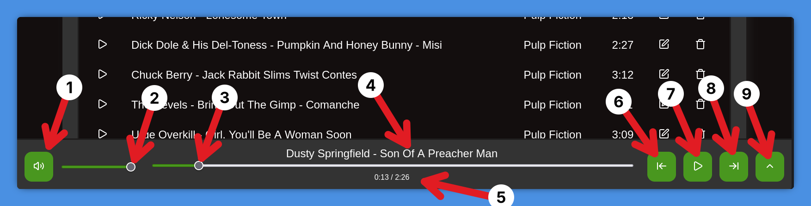

## Technická dokumentace
### Použité technologie a knihovny
- **Jazyk:** Typescript
- **Framework:** Svelte
- **Build systém:** Vite

- **sv-router** - Router pro klientskou navigaci mezi stránkami
- **lucide icons** - Ikony
- **music-media-browser** a **buffer** - Čtení metadat z nahraných MP3 souborů
- **simplex-noise** - Generování *perlinovského* šumu pro *cover arts* playlistů
- **vite-plugin-pwa** - Cachování souborů pro offline režim

### Architektura
Aplikace používá vrstevnatou architekturu Entity → Repository → Service → UI.

Vrstvu *Repository* lze v tomto případě považovat spíše za DAO, které poskytuje metody pro základní operace CRUD. 

Vrstva *Entity* je zde realizována pouze prostřednictvím interfaců, které definují strukturu dat, se kterými aplikace pracuje.

### Ukládání skladeb
Skladby a cover arts playlistů se ukládají do IndexedDB jako bloby a jsou považovány za samostatné entity typu MediaFile. 
Tyto entity jsou následně propojeny s objekty Track nebo Playlist, které na ně mají vazbu.

Při nahrání MP3 souboru jsou pomocí knihovny *music-media-browser* načtena jeho metadata, jako název skladby, autor nebo album. 
Pokud některá metadata nejsou dostupná, aplikace použije výchozí hodnoty, aby bylo možné skladbu bez problémů zobrazit a přehrát.

### Generování *cover arts* playlistů
Z názvu playlistu se nejprve vytvoří 32bitový hash, který slouží jako seed pro vytvoření pseudonáhodné funkce *mulberry32*. 
Následně je vytvořen **x × x** grid, kde každá hodnota na pozici (i, j) odpovídá výstupu *Perlinova šumu*, 
přičemž samotný *Perlinův šum* využívá jako seed právě funkci mulberry32.

Každá výsledná hodnota na pozici (i, j) je poté namapována na konkrétní barvu a vykreslena jako čtverec do SVG obrázku. 
V tomto kontextu je SVG využito v podstatě stejně jako rastrový obraz, kdy každý čtverec funguje jako jeden *pixel*. 
Použití SVG je zde zvoleno podle zadání, přestože princip generování připomíná spíše rastrovou reprezentaci obrazu.

Tento postup zaručuje, že playlisty se stejným názvem mají vždy shodné cover arty, protože generování je deterministické a závisí přímo na názvu playlistu.

### Vizualizér
Vizualizér funguje na principu audio analyzéru, který je připojen k přehrávanému zvuku. 
Z analyzéru jsou získávány frekvence zvuku, které jsou následně rozděleny do *x* skupin, přičemž *x* odpovídá počtu barů vizualizéru. 
Z každé skupiny frekvencí se vypočítá průměrná hodnota, která určuje výšku vykresleného baru.

Protože je vizualizér přímo připojen na audio, ztlumením hlasitosti se výška vykreslených barů sníží, jelikož frekvence jsou méně intenzivní.

Výsledný vizualizér se skládá ze čtyř totožných vizualizérů, které jsou horizontálně a vertikálně překlopeny, aby byl vizualizér vycentrován.

Rychlost aktualizace vizualizéru závisí na výkonu klientského počítače, protože je použita funkce requestAnimationFrame. 
Počet vykreslených barů se automaticky přizpůsobuje šířce displeje. 

Zaroveň je implementována smoothing konstanta, která zajišťuje, že animace probíhají plynule a nejsou příliš rychlé či skokové.

### Offline režim
Jelikož aplikace není závislá na žádné externí službě, je možné ji využívat plně offline. Pro tento účel je využit *vite-plugin-pwa*, který vytváří service workera, 
jenž nacachuje všechny potřebné soubory aplikace. Díky tomu je možné spustit a používat aplikaci i bez připojení k internetu, 
přičemž veškerá funkcionalita zůstává dostupná.

Plugin by teoreticky umožnil také vytvoření plnohodnotné PWA s pokročilejšími možnostmi, avšak tato funkcionalita nebyla v aplikaci testována.

### Optimalizace UI
Aplikace je optimalizována pro různá zařízení pomocí CSS media query selektorů, což zajišťuje správné zobrazení a funkčnost jak na mobilních telefonech, tak na větších displejích.

Z důvodu omezené velikosti obrazovky a přehlednosti uživatelského rozhraní však na menších zařízeních není zobrazován vizualizér.

### Informační zprávy
Uživatel je o stavu aplikace a výsledku akcí informován pomocí *toast* zpráv, které na něj vyskakují.